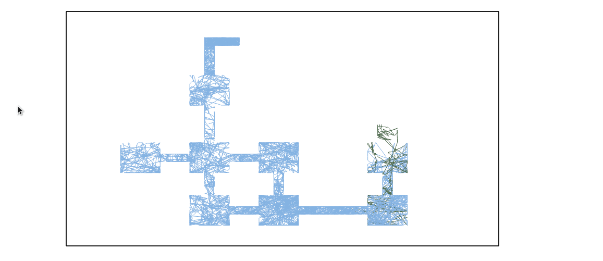

# drlviz

  

This figure display the main view of DRLviz, here you can interact with the Vizdoom environement, see the impact of those interactions on the agent inner representation, and finally observe the evolution through time and states in real time.

## Additional view

The following figure display an addtional tool to study a DRQN agent training on 'my_way_home' VizDoom scenario.

  

> available [here](http://vizdoom-viz.herokuapp.com/traj)
